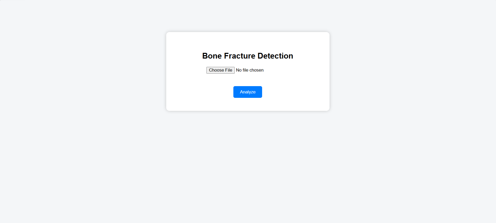
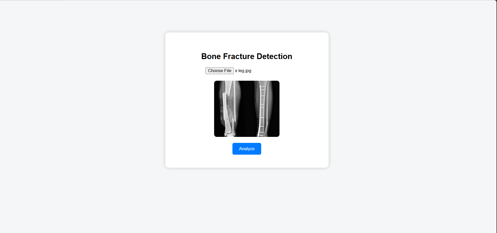
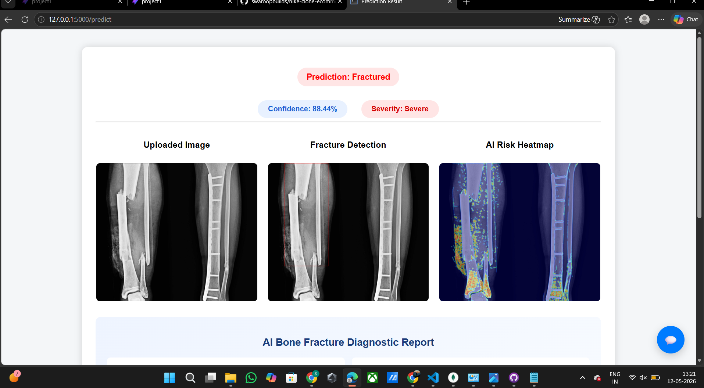
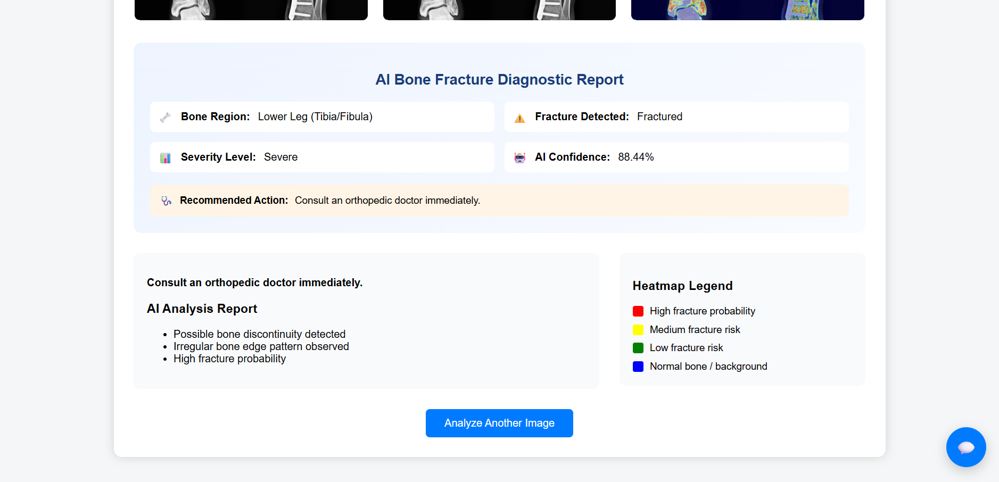
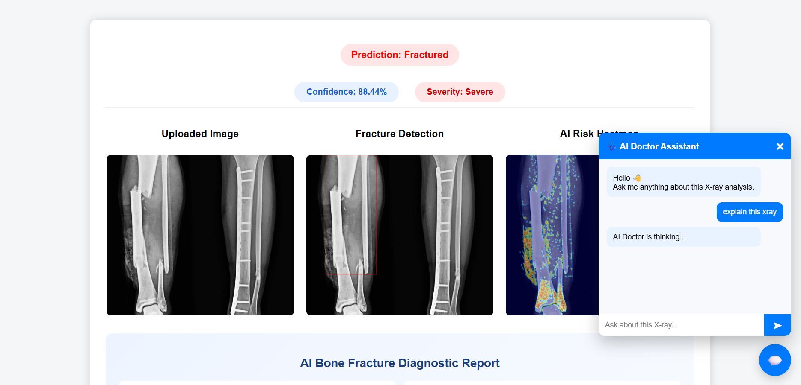

# 🦴 AI-Powered Bone Fracture Detection with Generative AI Diagnostic Reporting

An AI-powered medical imaging system that detects bone fractures from X-ray images using Deep Learning and provides AI-generated diagnostic explanations using Generative AI.

---

# 🚀 Features

- X-ray fracture detection
- AI confidence score prediction
- Fracture severity analysis
- Explainable AI heatmaps
- Bounding-box fracture localization
- AI-generated diagnostic explanation
- Non X-ray image detection
- Interactive Flask web application

---

# 🛠️ Technologies Used

- Python
- Flask
- TensorFlow / Keras
- OpenCV
- NumPy
- HTML/CSS
- JavaScript
- Google Gemini API
- Deep Learning (CNN)

---

# 📂 Project Structure

```bash
Bone-Fracture-Detection/
│
├── assets/
├── dataset/
├── static/
├── templates/
├── app.py
├── doctor_ai.py
├── fracture_box.py
├── fracture_heatmap.py
├── model.py
├── train.py
├── model.h5
├── requirements.txt
├── .gitignore
└── README.md
```

---

# 🖥️ User Interface

## Homepage



---

## Image Upload



---

## Fracture Prediction



---

## Fracture Detection Heatmap



---

## AI Diagnostic Chatbot



---

# ⚙️ Installation & Setup

```bash
git clone https://github.com/swaroopbuilds/bone-fracture-detection-ai.git

cd bone-fracture-detection-ai

pip install -r requirements.txt

python app.py
```

---

# 🧠 AI Workflow

1. Upload X-ray image
2. CNN model analyzes fracture patterns
3. Fracture region is highlighted using bounding-box detection
4. AI heatmap visualization is generated
5. Severity level is predicted
6. Gemini AI generates diagnostic explanation and medical response

---

# 📈 Future Improvements

- Multi-fracture detection
- Real-time hospital integration
- Cloud deployment
- Improved medical accuracy
- Mobile application support

---

# 👨‍💻 Author

Swaroop Malava